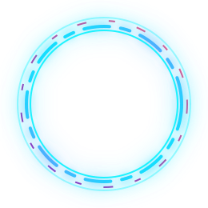

<div align="center">

  <!-- ==================== ANIMATED AVATAR ==================== -->

  

  <br/><br/>

  <!-- ==================== DYNAMIC TYPING TITLE ==================== -->

  <a href="https://git.io/typing-svg">
    
  </a>

  <br/><br/>

  <!-- ==================== SOCIAL BADGES ==================== -->

  <a href="https://www.linkedin.com/in/avinash-kumar-tiwary-b034a130b">
    
  </a>

  <a href="https://github.com/AvinashTiwary332">
    
  </a>

  <br/><br/>

  

</div>

---

# 👨‍💻 About Me

- 🎓 **Education:** 2nd Year B.Tech in CSE (AI & ML) at **Adamas University**
- 🔭 **Focus Areas:** Machine Learning, Artificial Intelligence, and Software Engineering
- 🌱 **Currently Exploring:** Data Structures & Algorithms, Deep Learning fundamentals, and Modern Web Technologies
- 💡 **Interested In:** AI/ML, software development, problem solving, and building real-world applications
- 🚀 **Goal:** Become a strong Software Developer with expertise in AI & Machine Learning
- ⚡ **Fun Fact:** I can spend 3 hours debugging code only to find a missing semicolon

---

# 🎯 Currently Working On

- 🧠 Data Structures & Algorithms
- 🤖 Artificial Intelligence & Machine Learning
- 🐍 Python Programming
- 💻 C / C++
- 🌐 Modern Web Development
- 🚀 Personal & Academic Projects
- 📚 Improving problem-solving skills

---

# 🛠️ Tech Stack & Tools

<p align="center">

  

</p>

<p align="center">

  <b>
    C • C++ • Python • React • Node.js • Tailwind CSS • Vite • Git • GitHub • VS Code
  </b>

</p>

---

# 🧭 My Learning Journey

<p align="center">

  <b>
    From Programming → DSA → Web Development → AI/ML → Real-World Projects 🚀
  </b>

</p>

<br/>

<details open>

<summary>🟢 <b>01 — Programming Foundations</b> | C • C++ • Python</summary>

<br/>

### 💻 Building the Foundation

- ✅ C Programming
- 🔄 C++
- 🔄 Python
- 🧠 Programming Fundamentals
- 🧩 Object-Oriented Programming
- 🛠️ Problem Solving
- 📌 Debugging & Code Optimization

**Goal:** Build strong programming fundamentals.

</details>

<br/>

<details>

<summary>🔵 <b>02 — Data Structures & Algorithms</b> | DSA • Problem Solving</summary>

<br/>

### 🧠 Learning to Think Like a Programmer

- 📌 Arrays
- 📌 Strings
- 📌 Linked Lists
- 📌 Stacks & Queues
- 📌 Trees
- 📌 Graphs
- 📌 Searching
- 📌 Sorting
- 📌 Recursion
- 📌 Time & Space Complexity
- 🚀 Problem Solving

**Goal:** Develop strong algorithmic thinking and problem-solving skills.

</details>

<br/>

<details>

<summary>🟣 <b>03 — Web Development</b> | React • Node.js • Tailwind • Vite</summary>

<br/>

### 🌐 Building for the Web

- 🌐 HTML & CSS
- ⚡ JavaScript
- ⚛️ React
- 🟢 Node.js
- 🎨 Tailwind CSS
- ⚡ Vite
- 🔗 APIs
- 🔐 Authentication
- 🗄️ Databases
- 🚀 Full-Stack Applications

**Goal:** Build modern and responsive web applications.

</details>

<br/>

<details>

<summary>🟠 <b>04 — Artificial Intelligence</b> | AI • Machine Learning</summary>

<br/>

### 🤖 Exploring Intelligent Systems

- 🧠 Artificial Intelligence fundamentals
- 🐍 Python for AI/ML
- 📊 Data preprocessing
- 📈 Machine Learning
- 🧮 Mathematics for ML
- 📉 Model evaluation
- 🔬 Experimentation
- 🧠 Feature Engineering

**Goal:** Understand how intelligent systems learn from data.

</details>

<br/>

<details>

<summary>🔴 <b>05 — Deep Learning</b> | Neural Networks • Advanced AI</summary>

<br/>

### 🧠 Going Deeper

- 🧬 Neural Networks
- 🔥 Deep Learning
- 👁️ Computer Vision
- 💬 Natural Language Processing
- 🧠 Model Training
- ⚙️ Optimization
- 🚀 AI-powered applications

**Goal:** Move from ML fundamentals toward practical Deep Learning.

</details>

<br/>

<details>

<summary>🟡 <b>06 — Real-World Projects</b> | Build • Test • Deploy</summary>

<br/>

### 🚀 Turning Knowledge Into Products

- 💡 Identify a problem
- 🧠 Design a solution
- 💻 Build the project
- 🧪 Test & Debug
- 🔧 Improve
- 🌐 Deploy
- 📊 Analyze
- 📚 Document

**Goal:** Turn knowledge into useful real-world applications.

</details>

<br/>

<details>

<summary>🏆 <b>07 — Long-Term Goal</b> | AI/ML Engineer • Software Developer</summary>

<br/>

### 🚀 The Bigger Picture

```text
Programming
     ↓
Data Structures & Algorithms
     ↓
Software Development
     ↓
Artificial Intelligence
     ↓
Machine Learning
     ↓
Deep Learning
     ↓
Real-World Projects
     ↓
🚀 Build Something Meaningful
